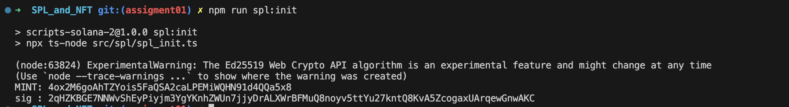
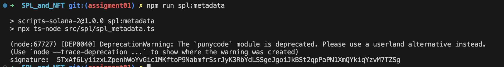
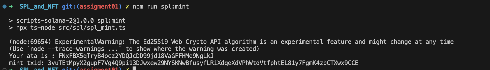
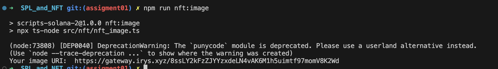
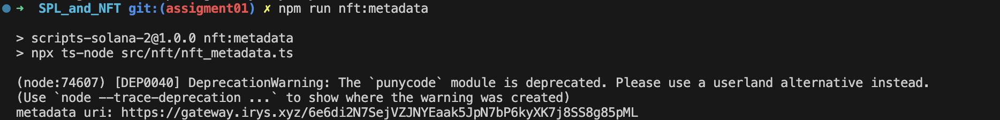
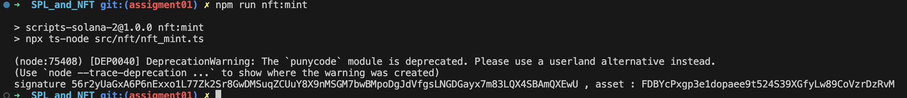
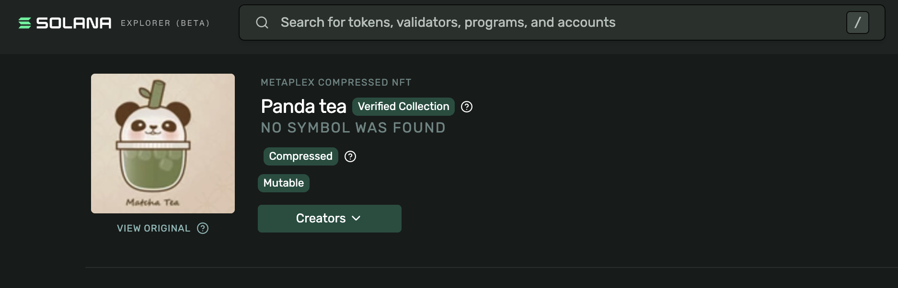
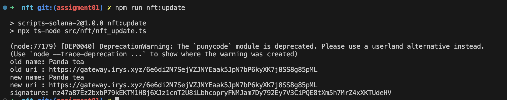
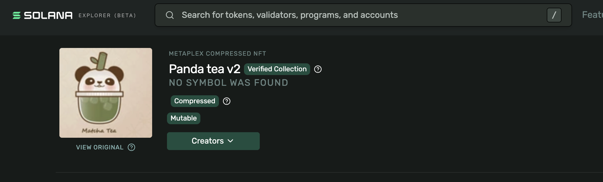

# SPL Token and MPL Core NFT

Solana devnet.

| Item | Address |
| --- | --- |
| Wallet | [`89JxEXQum...`](https://explorer.solana.com/address/89JxEXQum62x6xBHtDuwgCvyT3DjwTvMs13xpMHrZnbw?cluster=devnet) |
| SPL mint | [`4ox2M6goA...`](https://explorer.solana.com/address/4ox2M6goAhTZYois5FaQSA2caLPEMiWQHN91d4QQa5x8?cluster=devnet) |
| NFT asset | [`FDBYcPxgp...`](https://explorer.solana.com/address/FDBYcPxgp3e1dopaee9t524S39XGfyLw89CoVzrDzRvM?cluster=devnet) |

---

## Task 1 - SPL token

**Created the mint.** Six decimals. `createAccount` and `initializeMint` in one transaction.

[tx](https://explorer.solana.com/tx/2qHZKBGE7NNWvShEyPiyjm3YgYKnhZWUn7jjyDrALXWrBFMuQ8noyv5ttYu27kntQ8KvA5ZcogaxUArqewGnwAKC?cluster=devnet)

**Attached the token metadata.** Name and symbol on chain.

[tx](https://explorer.solana.com/tx/5TxAf6LyiizxLZpenhWoYvGic1MKftoP9NabmfrSsrJyK3RbYdLSSgeJgoiJkBSt2qpPaPN1XmQYkiqYzvM7TZSg?cluster=devnet)

**Created my ATA and minted 100 tokens.** ATA `FNxFBX5qTryB4ocz2YDQJcDD99jd18VaGFFHMe9NgLkJ`.

[tx](https://explorer.solana.com/tx/3vuTEtMpyX2gupF7Vg4Q9pi13DJwxew29NYSKNwBfusyfLRiXdqeXdVPhWtdVtfphtEL81y7FgmK4zbCTXwx9CCE?cluster=devnet)

**Transferred 10 tokens.** Recipient ATA `x9HaFz5sMdmXypruV8pvWtz64JmdGhb2L8YDt3DAwzC`.

[tx](https://explorer.solana.com/tx/59LFyBNDrZuirTSkbPBQTzbAWP8xm3kpgjpcsfYu4JXx6Fx2nMnSnqZ6MpJV9ictMpSTowL2CbRrBF3AKzWSckod?cluster=devnet)

---

## Task 2 - MPL Core NFT

**Uploaded the image to Irys.**

[image](https://gateway.irys.xyz/8ssLY2kFzZJYYzxdeLN4vAK6M1h5uimtf97momV8K2Wd)

**Uploaded the metadata JSON to Irys.**

[metadata](https://gateway.irys.xyz/6e6di2N7SejVZJNYEaak5JpN7bP6kyXK7j8SS8g85pML)

**Minted the asset.** Only the name and the metadata URI go on chain.

[tx](https://explorer.solana.com/tx/56r2yUaGxA6P6nExxo1L77Zk2Sr8GwDMSuqZCUuY8X9nMSGM7bwBMpoDgJdVfgsLNGDGayx7m83LQX4SBAmQXEwU?cluster=devnet)

On chain, named `Panda tea`:

---

## Task 3 - Update the NFT

**Uploaded a new JSON and pointed the asset at it.** The wallet is the update authority.

[tx](https://explorer.solana.com/tx/nz47a87Ez2bxbP79kEKTM1H8j6XJz1cnT2U8iLbhcopryFNMJam7Dy792Ey7V3CiPQE8tXm5h7MrZ4xXKTUdeHV?cluster=devnet)

The script read the asset back too early and printed stale values. The chain has the change. Name is now `Panda tea v2`:

---